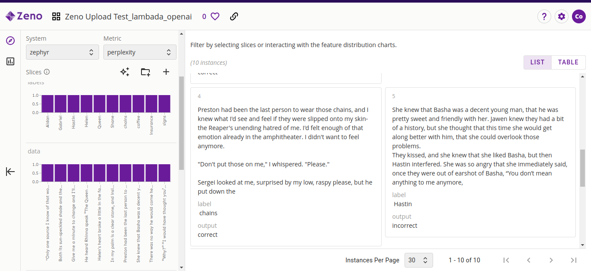
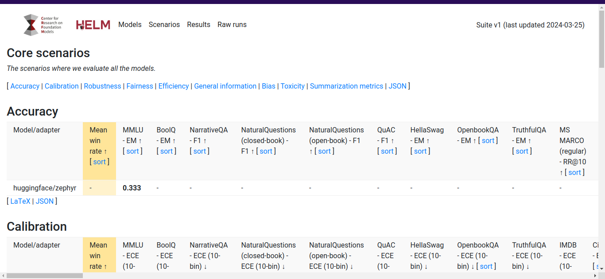
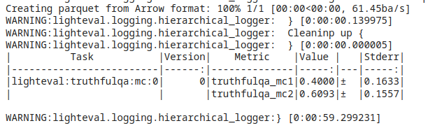

<div align="center">

# LLM Evaluation Frameworks

</div>

# Objective:
In this repository, three frameworks for LLM evaluation have been tested.
- EleutherAI's lm-evaluation-harness
- Stanford CRFM's HELM
- HaggingFaces's LightEval

The model evaluated is [Stable LM 2 Zephyr 1.6B](https://huggingface.co/stabilityai/stablelm-2-zephyr-1_6b) 


## Download Model
We can download the model via the following commands
```
pip install "huggingface_hub[cli]" hf_transfer
export HF_HUB_ENABLE_HF_TRANSFER=1
huggingface-cli download stabilityai/stablelm-2-zephyr-1_6b --revision main --local-dir zephyr --local-dir-use-symlinks False
```


## lm-evaluation-harness

To install the package, run the following command
```
git clone https://github.com/EleutherAI/lm-evaluation-harness
cd lm-evaluation-harness
pip install -e .[zeno]
```

The `[zeno]` argument specifies that we will be uploading the results to Zenohub.

To run the evaluation, 

```
lm_eval --model hf \
--model_args pretrained=./zephyr,tokenizer=./zephyr,dtype=float16 \
--tasks pythia \
--batch_size auto \
--log_samples \
--output_path output/zephyr \
--limit 10
```

This will print a table that summarizes the evaluation results.

We can upload the results to Zenohub via

```bash
%env ZENO_API_KEY={YOUR_ZENO_API_KEY}
python lm-evaluation-harness/scripts/zeno_visualize.py --data_path output --project_name "Zephyr Eval"
```
Here, you can visualize the samples input/output as well as the scores.


## HELM

To install the HELM package, run
```
pip install crfm-helm
```

```
echo 'entries: [{description: "mmlu:subject=philosophy,model=huggingface/zephyr", priority: 1}]' > run_specs.conf

helm-run --conf-paths run_specs.conf --suite v1 --max-eval-instances 10 --enable-local-huggingface-models ./zephyr

helm-summarize --suite v1
```

To view the results, start the HELM server via

```bash
helm-server
```



The complete Colab code can be found [here](./notebook/zephyr_lmevalharness_helm.ipynb).


## LightEval

First install via
```
git clone https://github.com/huggingface/lighteval.git
cd lighteval
pip install .
```

Using a simple `pip install lighteval==0.2.0` will not work since the command needs to launch the file `run_evals_accelerate.py` from the current directory.


```
accelerate launch --num_processes=1 run_evals_accelerate.py \
    --model_args "pretrained=zephyr" \
    --tasks "lighteval|truthfulqa:mc|0|0" \
    --max_samples 10 \
    --output_dir output_dir"
```

You will get a table similar to the following.


Note that for demo purposes, all evaluations have been limited to 10 samples.


To-do:
- [ ] MosaicML's LLM Foundry
- [ ] LMM eval frameworks  